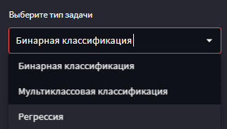
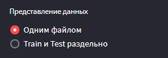
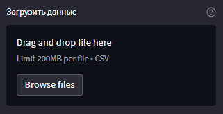
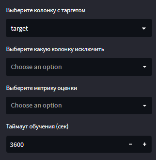

# Установка

### В docker
1. Склонируйте репозиторий и перейдите в директорию с проектом
2. Выполните

```bash
docker-compose up -d
```


### На хосте
1. Склонируйте репозиторий и перейдите в директорию с проектом
2. Установите необходимые зависимости

```bash
pip install -r requirements.txt
```

3. Выполните

```bash
streamlit rum src/app.py
```

4. Перейдите по адресу http://localhost/


# Как пользоваться

1. Выбрать тип задачи из списка



На данный момент поддерживаются следующие типы задач:
- бинарная классификация
- мультиклассовая классификация
- регрессия

2. Выбрать, в каком виде представленны данные



- одним файлом - данные не разбиты на train И test, далее будет предложено выбрать размер
тестовой выборки
- Train и Test раздельно - train и test разделены по разным файлам

> В случае, если Train и Test разделены по разным файлам, то соответствующие файлы должны 
> содержать в названии слова train и test для правильного автоматического выбора обучающей
> и тестовой выборок.

3. Загрузить данные



В данный момент поддерживаются только данные в csv формате, с разделителем в виде запятой.

4. Выбрать параметры обучения



После успешной загрузки обучающей и тестовой выборки будет предложено выбрать параметры обучения,
а также будет выведен семпл из обучающей выборки.

5. Нажать кнопку "Запустить AutoML"